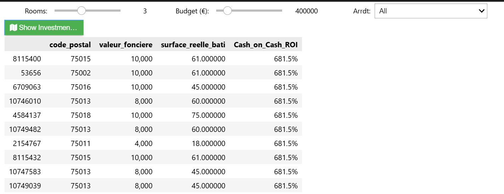
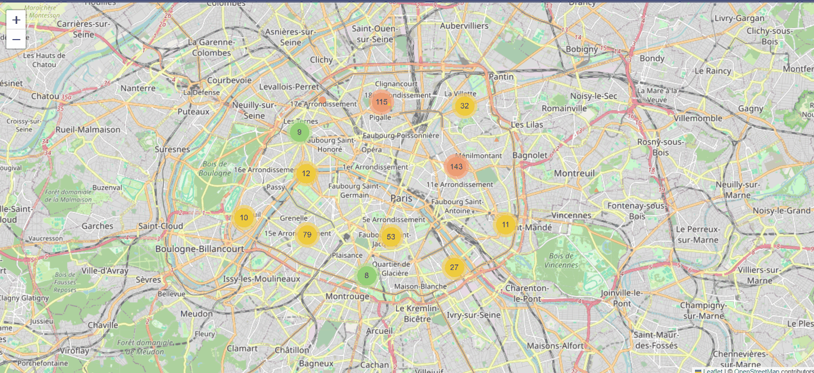
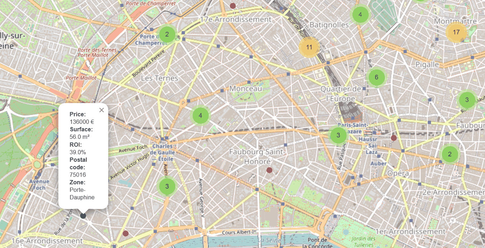

# Investing in Paris Under Rent Control

**A data pipeline that turns three French public datasets into a cash-on-cash ROI benchmark for every recent Paris apartment sale, and an interactive map that lets an investor find the good ones.**

Paris is a market where asking prices are public but net returns are not. Rent is legally capped by *l'encadrement des loyers*, and the cap depends on the exact neighbourhood polygon a property sits in, its size, its number of rooms, its construction era, and its energy rating. None of that is available in one place. This project assembles it.

The core question: **what ROI can an investor realistically expect on a Paris apartment once rent control is applied?**

---

## What this repository contains

| Component | Description |
|---|---|
| **Rent-zone GeoJSON** | 112 DRIHL KML files merged into one geospatial table of 8,960 rent-control zone records with their legal rent thresholds |
| **ROI engine** | A cash-on-cash return calculated per transaction, using the legally capped rent rather than a market estimate |
| **Investor tool** | Filter by rooms, budget, and arrondissement; get the top matches as a table and as a colour-coded interactive map |

This repository covers the data pipeline and the investor tool. The exploratory charts and the predictive model that appeared in the class presentation are not included here.

---

## Output

### Investor tool interface

Three inputs (rooms, budget, arrondissement), one button, and a ranked table of the highest-ROI matches.



### Interactive ROI map

Every matching property is plotted and clustered by density. Marker colour encodes the return band:




Zooming in breaks the clusters apart into individual properties. Clicking one opens its full detail: price, surface, computed ROI, postal code, and the DRIHL rent-control zone it falls in.



---

## Data sources

All three are open French public datasets.

| Source | Publisher | What it provides |
|---|---|---|
| **DVF** (Demandes de Valeurs Foncières) | DGFIP | Every recorded property transaction: price, address, surface, rooms, coordinates |
| **DPE** (Diagnostic de Performance Énergétique) | ADEME | Energy performance class and construction year per address |
| **Paris rent zones** (KML) | DRIHL Île-de-France | Rent-control zone polygons with reference, capped, and floored rents |

The DRIHL KML files are downloaded automatically by Step 1. DVF and DPE have to be placed in `data/` manually because of their size. See [`data/README.md`](data/README.md).

---

## How it works

```
Step 1  Download 112 DRIHL KML files
        7 validity periods x 4 room counts x 4 construction eras
                    |
Step 2  Parse every KML into one GeoDataFrame (8,960 rows)
        Output: Paris_Rent_Zones_GDF.geojson
                    |
Step 3  Clean DVF and DPE independently
        Both reduced to a standardised ZIP_STREET_NUMBER address key
                    |
Step 4  Left-join DVF onto DPE on that key (~58% match rate)
        Output: paris_transactions_merged.csv
                    |
Step 5  Spatial join each transaction into its rent zone, apply the
        legal cap, compute cash-on-cash ROI
        Output: Paris_ROI_Calculated.csv
                    |
Step 6  Filter, rank, and map
        Output: investment_map.html
```

### The joining problem

DVF and DPE share no identifier. The only bridge is the street address, and the two datasets format addresses differently: DPE often leaves the street number field empty and folds the number into the street name instead, and both use inconsistent accenting and punctuation.

Step 3 handles this by folding accents to ASCII, uppercasing, stripping punctuation, and pulling stray street numbers back out of the street name with a regex. That produces roughly a 58% match rate between the two datasets, which is a strong result for address-based joining on French public data.

### The rent cap

The energy class determines which of the three legal thresholds applies:

| DPE class | Applicable rent |
|---|---|
| A, B, C | `Loyer_Ref_Majore` (120% of reference) |
| D, E | `Loyer_Ref` (reference) |
| F, G | `Loyer_Ref_Minore` (90% of reference) |
| No DPE match | `Loyer_Ref` (conservative default) |

### The ROI model

```
Estimated_Monthly_Gross_Rent = capped_rent_per_m2 * surface
Annual_Gross_Rent            = Estimated_Monthly_Gross_Rent * 12

annual_taxes    = property_value * 0.5%
annual_expenses = Annual_Gross_Rent * 15%
loan_amount     = property_value * 80%
annual_interest = loan_amount * 4.0%

Annual_Net_Cash_Flow = Annual_Gross_Rent - annual_taxes
                       - annual_expenses - annual_interest

cash_invested    = property_value * 20%
Cash_on_Cash_ROI = Annual_Net_Cash_Flow / cash_invested * 100
```

All assumptions live in [`src/config.py`](src/config.py) and can be changed in one place.

---

## Assumptions and limitations

Worth reading before trusting any number this produces.

**Scope**
- Apartments only (DVF `code_type_local = 2`), standard *Vente* transactions only. Commercial, land, and dependency sales are excluded.
- Every transaction is modelled as a buy-to-let, rented unfurnished.

**Financial model**
- Mortgage interest is a flat 4.0% on the full loan with no amortisation. This keeps the figure a clean cash-on-cash estimate, not an IRR. It slightly understates the return of a real amortising loan in later years.
- `valeur_fonciere` is treated as the full property value, so notary fees, renovation, and furnishing are not modelled.
- Operating costs are a flat 15% of gross rent standing in for vacancy, management, and maintenance.

**Data**
- Properties without a DPE match default to the conservative reference rent, and are filtered out before the final ROI calculation.
- Step 5 samples 100,000 transactions to keep the spatial join tractable.
- DVF contains near-zero sale prices (family transfers, partial shares) that produce ROI figures in the hundreds of percent. Step 6 trims the 1st and 99th percentiles so these do not dominate the map. Any extreme ROI figure visible in a screenshot is one of these artefacts, not a real opportunity.
- Rent-zone polygons are matched on location only. The room count and construction era carried in the KML grid are present in the zone table but are not used as additional join keys in the spatial association.

---

## Setup

```bash
git clone https://github.com/<your-username>/paris-roi-rent-control.git
cd paris-roi-rent-control

python -m venv .venv
source .venv/bin/activate        # Windows: .venv\Scripts\activate

pip install -r requirements.txt
```

`geopandas` and `fiona` depend on GDAL. If pip struggles, conda is the smoother route:

```bash
conda install -c conda-forge geopandas fiona shapely
```

---

## Running it

### Option 1: the notebook

```bash
jupyter notebook notebooks/paris_roi_pipeline.ipynb
```

Run the cells top to bottom. The final cell renders the interactive widget interface shown above. This is the version presented in class.

### Option 2: the pipeline scripts

```bash
python src/run_pipeline.py
```

Steps 1 and 2 need only an internet connection and will produce the rent-zone GeoJSON on their own. The pipeline stops there and tells you what to do if the DVF and DPE extracts are not yet in `data/`.

Individual steps also run standalone:

```bash
python src/step1_download_kml.py
python src/step2_rent_zones.py
python src/step5_roi.py
```

### Using the tool programmatically

```python
from src.step6_investor_tool import load_roi_data, build_map_for

roi_df = load_roi_data()
build_map_for(roi_df, num_rooms=3, max_budget=400_000, arrondissement="11")
# writes data/investment_map.html
```

---

## Repository structure

```
paris-roi-rent-control/
├── README.md
├── requirements.txt
├── data/
│   └── README.md                    how to obtain DVF and DPE
├── docs/
│   └── images/                      output screenshots
├── notebooks/
│   └── paris_roi_pipeline.ipynb     the notebook presented in class
└── src/
    ├── config.py                    paths, thresholds, financial assumptions
    ├── step1_download_kml.py        fetch DRIHL rent-control KMLs
    ├── step2_rent_zones.py          build the master rent-zone GeoJSON
    ├── step3_clean_dvf_dpe.py       clean and key both datasets
    ├── step4_merge.py               join sales to energy ratings
    ├── step5_roi.py                 spatial join and ROI calculation
    ├── step6_investor_tool.py       filtering, map, widget interface
    └── run_pipeline.py              run everything end to end
```

---

## Why it matters beyond real estate

Rent control is a regulation that is public, precise, and effectively unreadable to the people it governs. The rules are published as 112 separate geographic files that nobody outside the administration is going to assemble by hand.

Open data plus a pipeline makes that legible. An individual can benchmark a market that normally requires a broker, and a policymaker can see what the regulation actually does to returns rather than what it was intended to do. The same pattern applies anywhere a rule is technically public but practically opaque.

---

## Authors

Group project, Python Programming, ESSEC Business School.

- Foucauld Riché
- Bashir Stanakzai
- Edoardo Grossi
- Madhurjya Bharadwaj

---

## License

MIT. See [LICENSE](LICENSE).

Note that the underlying datasets are governed by their own terms. DVF and DPE are published under the Licence Ouverte / Open Licence.
